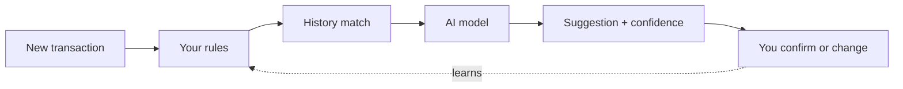
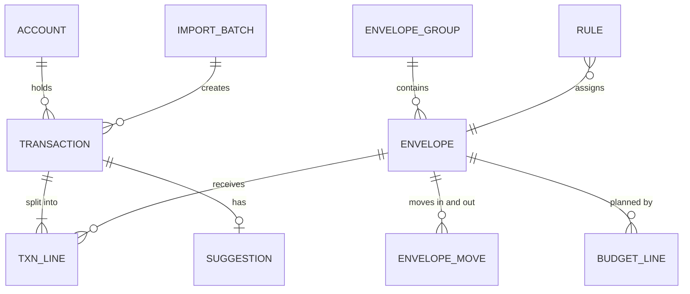

# Requirements

Every identifier here is cited in the code. `git grep FR-37` finds the invariant
check; `git grep CA-3` finds the history layer. That traceability is the point of
this file: a comment saying "(FR-37)" should lead somewhere.

The **Status** column is what the code actually does today, not what was planned.
Anything not built links to its issue.

Priority as originally set: **M** = must have for the first usable release, **S** =
should have soon after, **C** = could have.

## Core concepts

The model rests on one rule: every unit of money in your accounts is assigned to
exactly one envelope, so the sum of all envelope balances always equals the sum of
all account balances.

| Term | Meaning |
| --- | --- |
| Account | A real bank, card or cash account. Holds transactions and a balance. |
| Transaction | Money in or out of an account, with a date, payee, amount and a status. |
| Envelope | A virtual bucket of money for a purpose (Gas, Groceries, Water bill). Has a balance. |
| Envelope group | A named set of envelopes (Vehicle: Gas, Repairs, Insurance). |
| Budget | The planned monthly amount each envelope receives. |
| Allocation | Moving income into envelopes, normally once per month per the budget. |
| Transfer | Moving money between envelopes, with no effect on accounts. |
| Split | One transaction divided across several envelopes. |
| Status | A transaction is *pending review* or *confirmed* (a person accepted it). |
| Income envelope | The holding place for unallocated income until it is allocated. |

## Accounts and transactions

| ID | Requirement | Pri | Status |
| --- | --- | --- | --- |
| FR-1 | Create, edit and archive accounts (chequing, savings, credit card, cash), each with an opening balance. | M | Built |
| FR-2 | Add, edit and delete transactions manually. | M | Built |
| FR-3 | A transaction stores date, amount, account, the raw bank description, a cleaned payee name, notes, status and envelope(s). | M | Built |
| FR-4 | Split one transaction across several envelopes, with the split amounts required to sum to the total. | M | Built |
| FR-5 | A transfer between two accounts is stored as a linked pair and never counted as spending or income. | M | Built |
| FR-6 | Reconcile an account: mark transactions cleared and compare to a statement balance. | S | Not built ([#1](https://github.com/sakian/manilla/issues/1)) |

## File import

| ID | Requirement | Pri | Status |
| --- | --- | --- | --- |
| FR-7 | Import OFX and QFX files, mapping each file's account to a Manilla account (remembered for next time). | M | Built |
| FR-8 | Import CSV with a column-mapping step, saved per account for reuse. | S | Not built ([#2](https://github.com/sakian/manilla/issues/2)) |
| FR-9 | Show a preview before committing: new rows, exact duplicates, and possible duplicates. | M | Built |
| FR-10 | Deduplicate on the bank's transaction ID (OFX FITID) per account. For CSV, fall back to date + amount + description. Possible duplicates go to a review list and are never dropped silently. | M | Built |
| FR-11 | Importing the same file twice, or two overlapping date ranges, must change nothing the second time. | M | Built |
| FR-12 | Every imported transaction arrives as pending review with a suggested envelope. | M | Built |
| FR-13 | Keep an import log (file, date, counts) and allow undoing a whole import. | S | Built |
| FR-14 | If the file carries an ending balance, compare it to the resulting account balance and warn on a mismatch. | S | Built |

## Automatic bank feeds

Deferred as a group, on a decision rather than for lack of time: every route
available today either does not exist in Canada or works by holding your online
banking credentials. See [measurements.md](measurements.md) and the README.

| ID | Requirement | Pri | Status |
| --- | --- | --- | --- |
| FR-15 | Connect accounts through a bank-data aggregator, chosen per account. | S | Deferred ([#10](https://github.com/sakian/manilla/issues/10)) |
| FR-16 | Sync at least daily and on demand. | S | Deferred ([#10](https://github.com/sakian/manilla/issues/10)) |
| FR-17 | Synced transactions follow the same pending-review path as imports. | S | Deferred ([#10](https://github.com/sakian/manilla/issues/10)) |
| FR-18 | A synced transaction and a file-imported one for the same bank entry must merge into one, never duplicate. | S | Deferred ([#10](https://github.com/sakian/manilla/issues/10)) |
| FR-19 | Handle the pending-to-posted change (new ID, changed amount) without creating duplicates. | S | Deferred ([#10](https://github.com/sakian/manilla/issues/10)) |
| FR-20 | Bank login credentials never touch the app. Only the aggregator's access token is stored, encrypted, and can be revoked in one click. | M | Deferred ([#10](https://github.com/sakian/manilla/issues/10)) |

The schema is shaped for this already: `bank_sync` is a transaction source and
`aggregator` an external-id kind, so a feed is additive rather than a rewrite.

## Envelopes and groups

| ID | Requirement | Pri | Status |
| --- | --- | --- | --- |
| FR-21 | Create, rename, reorder and archive envelopes, each belonging to one group. | M | Built. Envelopes are alphabetical within a group; the manual order is on groups, which are read as a shape rather than scanned. |
| FR-22 | Groups are collapsible and show a rolled-up balance, budgeted amount and spent amount. | M | Partial. Groups collapse; the roll-up was removed from view mode as noise beside the per-envelope figures. ([#13](https://github.com/sakian/manilla/issues/13)) |
| FR-23 | By default an envelope's balance carries over month to month. | M | Built |
| FR-24 | An envelope may go negative. It is shown as overspent and listed on the dashboard. | M | Built |
| FR-25 | Archiving an envelope with a non-zero balance requires moving that balance first. | M | Built |
| FR-26 | A goal envelope has a target amount and date, and shows the monthly amount needed to reach it. | S | Not built ([#12](https://github.com/sakian/manilla/issues/12)) |

## Monthly budget and income allocation

| ID | Requirement | Pri | Status |
| --- | --- | --- | --- |
| FR-27 | Set a default monthly amount per envelope. The budget screen shows total planned against expected income. | M | Built |
| FR-28 | Income transactions land in the income envelope, awaiting allocation. | M | Built |
| FR-29 | A one-click "fund envelopes" action builds allocations from the budget, with an editable preview. | M | Built |
| FR-30 | Allocations are stored as records, dated and reversible, so past months stay correct when the budget changes later. | M | Built |
| FR-31 | Warn when planned amounts exceed income received or expected, and when income is left unallocated. | M | Built |
| FR-32 | Override the budget for a single month without changing the default. | S | Partial. The data model and the reads support it; no screen writes one. ([#6](https://github.com/sakian/manilla/issues/6)) |
| FR-33 | Support annual or irregular bills by budgeting a yearly amount that funds monthly. | S | Not built ([#12](https://github.com/sakian/manilla/issues/12)) |

## Envelope transfers

| ID | Requirement | Pri | Status |
| --- | --- | --- | --- |
| FR-34 | Move money between any two envelopes with an amount, date and note. | M | Built |
| FR-35 | From an overspent envelope, offer a one-tap "cover this" action that suggests source envelopes with spare balance. | S | Built |
| FR-36 | Transfers appear in each envelope's history and are excluded from spending reports. | M | Built |
| FR-37 | Show a running check that total envelope balances equal total account balances, and flag any difference. | M | Built |

## Categorization

Every new transaction gets a suggested envelope from a layered pipeline, cheapest
and most certain layer first, and stays pending review until you confirm it.

| ID | Requirement | Pri | Status |
| --- | --- | --- | --- |
| CA-1 | Normalize payees (strip store numbers, dates and card fragments) so two spellings of one merchant match. | M | Built |
| CA-2 | User rules: if payee contains X (and optionally amount range or account), then envelope Y. | M | Built. Rules are never written for you — Manilla notices when one would help and asks. |
| CA-3 | History match: suggest the envelope most often used for the same normalized payee, weighted by recency. | M | Built |
| CA-4 | Amount awareness: use typical amount as a signal, so a fuel-sized charge at a fuel station scores high for Gas while a small one may score toward Snacks. | S | Built |
| CA-5 | AI model layer: for payees the first layers cannot place, send the payee text, amount, date, memo and your envelope list to a language model, which returns an envelope, a confidence score and a one-line reason. | S | Built |
| CA-6 | AI may also propose splits but never applies one without confirmation. | C | Not built ([#11](https://github.com/sakian/manilla/issues/11)) |
| CA-7 | Confidence bands: high confidence (0.95 or above) is pre-assigned and shown as suggested; low confidence is left uncategorized with the top candidates listed. | M | Built |
| CA-8 | The AI is limited to envelopes that exist. It cannot invent envelopes. | M | Built |
| CA-9 | Show why a suggestion was made (rule, history count, or AI reason) on each row. | S | Built |

## Review queue

| ID | Requirement | Pri | Status |
| --- | --- | --- | --- |
| RQ-1 | A review queue lists every pending-review transaction with the suggested envelope visible and changeable in one tap or keystroke. | M | Built |
| RQ-2 | Confirm one, several, or many at once. | M | Built, differently. The queue stages decisions and saves in one go; bulk "confirm all high-confidence" was dropped, because [measurements.md](measurements.md) puts safe auto-confirmation at 16% of transactions. |
| RQ-3 | Fast recategorization: envelope picker, keyboard shortcuts, and mobile-friendly tap targets. | M | Built. Type-ahead was dropped in favour of an organised list. |
| RQ-4 | Pending transactions already affect the envelope balance (marked as unconfirmed), so the dashboard is accurate mid-month before review is done. | M | Built, narrowed. Only suggestions in the medium band and above are applied; below that the money stays unassigned rather than a guess moving a balance. Each envelope card shows its unreviewed share. |
| RQ-5 | Confirmed transactions can still be edited later. A change updates rules and history. | M | Built |
| RQ-6 | Show a count of items awaiting review, and an age indicator for items pending more than a set number of days. | S | Built |

## Views and dashboard

| ID | Requirement | Pri | Status |
| --- | --- | --- | --- |
| VW-1 | Dashboard for the current month: every envelope as a progress bar of spent against available, grouped, with a month selector. | M | Partial. Figures yes, bars and the month selector no. ([#3](https://github.com/sakian/manilla/issues/3)) |
| VW-2 | Pace marker on each bar showing how far through the month you are. | S | Not built ([#3](https://github.com/sakian/manilla/issues/3)) |
| VW-3 | Dashboard callouts: overspent envelopes, unallocated income, transactions awaiting review, and the FR-37 balance check. | M | Built, as one ranked list shown on every main screen. |
| VW-4 | Envelope view: envelopes in groups with balance, budgeted and spent. Opening one shows its transactions, transfers, allocations and a balance-over-time chart. | M | Partial. Everything but the chart. ([#4](https://github.com/sakian/manilla/issues/4)) |
| VW-5 | Account view: accounts with balances, and each account's transactions filterable by status, date, payee and envelope. | M | Built, unified. One `/transactions` screen behind every filter. |
| VW-6 | Global transaction search and filter (text, amount range, date range, envelope, status). | M | Built |

## Reports

| ID | Requirement | Pri | Status |
| --- | --- | --- | --- |
| RP-1 | Spending per envelope and per group over a custom date range, with drill-down. | M | Built |
| RP-2 | Monthly trend of spending for one or more envelopes, over any number of months. | M | Built |
| RP-3 | Compare two periods (this month against last, this year against last) per envelope. | S | Not built ([#5](https://github.com/sakian/manilla/issues/5)) |
| RP-4 | Income against spending by month, and budgeted against actual per envelope. | S | Not built ([#5](https://github.com/sakian/manilla/issues/5)) |
| RP-5 | Reports exclude transfers and count each split at its envelope's share. | M | Built by construction: reports read envelope lines, never transactions. |
| RP-6 | Export any report or transaction list as CSV. | M | Built |

## Insights

Code does the arithmetic and detection; a language model only explains findings in
plain words, so numbers shown are always computed, never generated. None of this
is built.

| ID | Requirement | Pri | Status |
| --- | --- | --- | --- |
| AI-1 | Anomaly detection against the payee's or envelope's own history — a utility bill more than 30% above its trailing 12-month average, or an unusually large charge from a new payee. | S | Not built ([#11](https://github.com/sakian/manilla/issues/11)) |
| AI-2 | Each insight states the finding, the numbers behind it, and a suggested next step. | S | Not built ([#11](https://github.com/sakian/manilla/issues/11)) |
| AI-3 | Trend detection: an envelope rising or falling steadily over several months, adjusted for seasonality once a year of data exists. | S | Not built ([#11](https://github.com/sakian/manilla/issues/11)) |
| AI-4 | Recurring-charge detection: new subscriptions, price increases, and charges that stopped or doubled. | C | Not built ([#11](https://github.com/sakian/manilla/issues/11)) |
| AI-5 | Budget suggestions: an envelope consistently over or under budget gets a proposed new amount, applied only if accepted. | C | Not built ([#11](https://github.com/sakian/manilla/issues/11)) |
| AI-6 | An insights inbox where each item can be dismissed, snoozed, or marked "expected" to teach the detector. | S | Not built ([#11](https://github.com/sakian/manilla/issues/11)) |
| AI-7 | Natural-language questions about your own data, answered from computed queries, with the underlying rows shown. | C | Not built ([#11](https://github.com/sakian/manilla/issues/11)) |

## Migration

A one-time wizard brings in a multi-year history from another envelope budgeting
app, so reports, trends and categorization work from day one. The wizard asks
which app the file came from, so a second format is a loader rather than a
rewrite; one is implemented.

| ID | Requirement | Pri | Status |
| --- | --- | --- | --- |
| MG-1 | Import the exported transaction files through a guided wizard. Accept several files in one run and deduplicate across them. | M | Built |
| MG-2 | Preserve date, amount, payee, notes, account and envelope for every transaction. | M | Built |
| MG-3 | Show an envelope and group mapping step: merge, rename or archive before anything is written. | M | Built |
| MG-4 | Reproduce income, envelope-to-envelope transfers, account transfers and splits, so historical envelope balances come out right. Anything the export cannot represent is listed rather than guessed. | M | Built |
| MG-5 | Imported history is marked with its source and pre-set to confirmed, since it was already categorized. | M | Built |
| MG-6 | Run into a staging area first. Commit only after the reconciliation check, and allow the whole migration to be undone. | S | Built |
| MG-7 | Reconciliation report: compare envelope and account balances at the migration date with the balances you enter from the old app, and list every difference. | M | Partial. The comparison and the dated adjustments are implemented and tested; no screen reaches them. ([#7](https://github.com/sakian/manilla/issues/7)) |
| MG-8 | Migrated history seeds the payee history and AI examples immediately. | M | Built |
| MG-9 | The first bank import will overlap the last weeks of migrated history. Match on account, date and amount and attach the bank's transaction ID to the existing row instead of adding a duplicate. | M | Built |

**Known limit.** Past monthly *allocations* are not in a transaction export, so
past envelope *balances* cannot be rebuilt — only past *spending*. The wizard says
so before writing anything and closes the gap with dated adjustments you read off
your old app, rather than with a number from nowhere.

## Non-functional

This is financial data, so correctness, security and control over what reaches a
model rank above features.

| ID | Area | Requirement | Status |
| --- | --- | --- | --- |
| NF-1 | Money accuracy | Store amounts as integers in the currency's smallest unit, never floating point. Balances must always be reproducible from the transaction, allocation and transfer records. | Built |
| NF-2 | Integrity | Imports and migrations are atomic: they fully apply or not at all. Edits and deletions keep an audit trail. | Partial. Atomic yes; no audit trail. ([#8](https://github.com/sakian/manilla/issues/8)) |
| NF-3 | Authentication | Strong sign-in: passkeys, with session timeouts. | Built. Passkeys plus single-use recovery codes; sessions lapse after 12 idle hours and end after 30 days. |
| NF-4 | Data protection | Encrypt in transit and at rest. No bank credentials are ever stored. | Partial. TLS via the Tailscale node, and no credentials exist to store; at-rest encryption is the host's disk, not the app's. |
| NF-5 | AI data minimization | Send the model only what the task needs. Settings show exactly what is sent, with an off switch. | Built. Payee text, amount, date, memo and envelope names — see the note in the README about what a bank writes into a memo. |
| NF-6 | Data ownership | Full export of all data as CSV and JSON at any time, and a delete-everything option. | Built |
| NF-7 | Backup and recovery | Automated daily backups with a tested restore procedure. | Built |
| NF-8 | Performance | Dashboard under 1 second with 10 years of history. A 1,000-row import previews in under 5 seconds. | Partial. Met on a real multi-year database; not continuously measured. |
| NF-9 | Usability | Works on a phone-sized screen. Keyboard-navigable review queue. WCAG 2.1 AA contrast. | Built |
| NF-10 | Graceful degradation | If the AI service is down, everything else keeps working, and failed items retry later. | Built. A failed call stops the layer, not the import. |
| NF-11 | Observability | Import and AI errors are logged and visible in plain language, not only to a developer. | Built |
| NF-12 | Testability | Import parsing, deduplication and balance maths are covered by automated tests using real, anonymized bank files. | Built |

## Business rules

1. Envelope balance = its transaction lines (pending included) + moves in − moves out.
2. The sum of all envelope balances, income included, equals the sum of all account balances. Checked after every write (FR-37).
3. A transaction's amount equals the sum of its lines.
4. Transfers between your own accounts have no envelope lines and never appear in spending.
5. Income enters the income envelope. Only an allocation move takes it out.
6. Confirming a transaction changes its status, not any balance.
7. Every transaction keeps every external ID it has ever had, so later imports can match rather than duplicate.

## Data model

Money lives in two ledgers that must always agree: accounts hold real money,
envelopes hold its assignment. A transaction changes both at once, while an
envelope move changes only envelopes.

| Entity | Holds |
| --- | --- |
| Transaction | Account, date, amount, raw and cleaned payee, status, source and external IDs for deduplication. |
| Txn line | One envelope's share of a transaction. An unsplit transaction has one line. |
| Suggestion | The proposed envelope, which layer produced it, confidence and reason. Kept apart from the confirmed lines so accuracy can be measured. |
| Envelope move | An allocation from income, or a transfer between envelopes: from, to, amount, date, kind. |
| Budget line | Envelope, month (or default), planned amount. |
| Rule | Match conditions and target envelope. |
| Import batch | File or sync run, counts, and the ability to undo. |

The schema is `db/schema.ts`, and it is the authority; this table is the summary.

## Scope

Version 1 is a single-household tool for one primary user.

**Assumptions.** One budget, one primary user — a second login is a later phase.
One currency. A responsive web app, usable on phone and desktop. Bank data enters
by file import. AI features call a hosted model, so a cost and privacy control is
required.

**Out of scope for now.** Investment tracking, net worth, debt payoff planning,
bill payment. Multi-currency, tax reporting, business or multi-budget use. Shared
budgets with separate permissions for many users.
